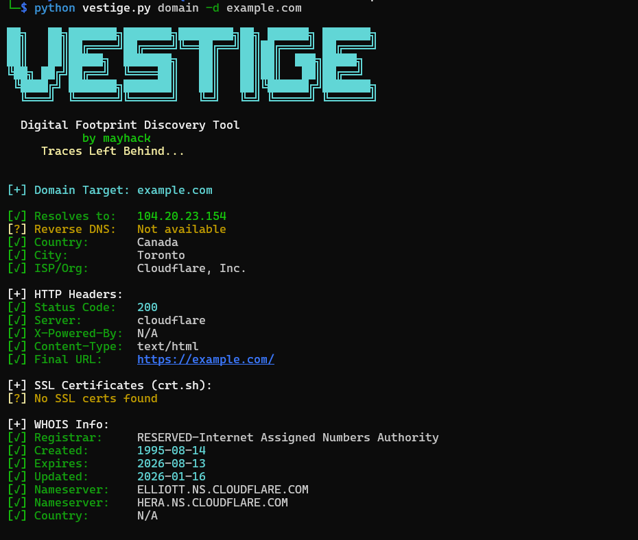

# VESTIGE — Digital Footprint Discovery Tool
### by mayhack | *Traces Left Behind...*


---

## What is VESTIGE?

VESTIGE is a modular OSINT CLI tool that discovers digital footprints of targets across the internet.  
Search emails, domains, IPs, usernames, and phone numbers — all from one tool.

---

## Features

- Email Reconnaissance — breach check, disposable detection
- Domain Reconnaissance — DNS, WHOIS, SSL certs, subdomains, HTTP headers
- IP Reconnaissance — GeoIP, ISP, abuse score
- Username Reconnaissance — 48+ platform search
- Phone Reconnaissance — carrier, country, line type
- Color-coded terminal output
- Fast parallel searches

---

## Installation

```bash
git clone https://github.com/verseofmayank/vestige-.git
cd vestige-
pip install -r requirements.txt --break-system-packages
```

---

## API Keys Setup

Copy the example env file and add your keys:

```bash
cp env.example .env
nano .env
```

| Key | Source | Free? |
|-----|--------|-------|
| `RAPIDAPI_KEY` | rapidapi.com (BreachDirectory) | ✅ Free tier |
| `KICKBOX_KEY` | kickbox.com | ✅ Free |
| `GITHUB_TOKEN` | github.com/settings/tokens | ✅ Free |
| `NUMVERIFY_KEY` | numverify.com | ✅ Free (250/mo) |
| `ABUSEIPDB_KEY` | abuseipdb.com/register | ✅ Free |

> Tool works without keys too — modules with missing keys will be skipped gracefully.

---

## Usage

```bash
python vestige.py -h
```


```bash
# Email recon
python vestige.py email -e target@example.com

# Domain recon
python vestige.py domain -d example.com

# IP recon
python vestige.py ip -i 8.8.8.8

# Username recon (48+ platforms)
python vestige.py username -u targetuser

# Phone recon
python vestige.py phone -p +919876543210
```

---

## Module Details

| Module | Flag | What it does |
|--------|------|-------------|
| email | `-e` | Breach check, disposable detection |
| domain | `-d` | DNS, WHOIS, SSL certs, subdomains, HTTP headers |
| ip | `-i` | GeoIP, ISP, coordinates, abuse score |
| username | `-u` | Searches 48+ social platforms |
| phone | `-p` | Carrier, country, line type via NumVerify |

---

## APIs Used

| API | Module | Purpose |
|-----|--------|---------|
| BreachDirectory (RapidAPI) | Email | Breach lookup |
| Kickbox | Email | Disposable email detection |
| ipapi.co | IP / Domain | GeoIP — free, no key needed |
| AbuseIPDB | IP | Reputation score |
| crt.sh | Domain | SSL certs + subdomains — no key needed |
| python-whois | Domain | WHOIS data |
| NumVerify | Phone | Carrier & line type |
| GitHub API | Username | Profile check |

---

## Disclaimer

This tool is for **educational and authorized security testing only**.  
Unauthorized access to computer systems is illegal.  
Always get permission before investigating targets.

---

## Future Updates

- [ ] JSON / Markdown report export
- [ ] AI-powered chaining mode
- [ ] Google Dork generator
- [ ] Wayback Machine integration
- [ ] 300+ platform username search (whatsmyname integration)
- [ ] Shodan integration

---

## Author

**mayhack**  
*Traces Left Behind...*
